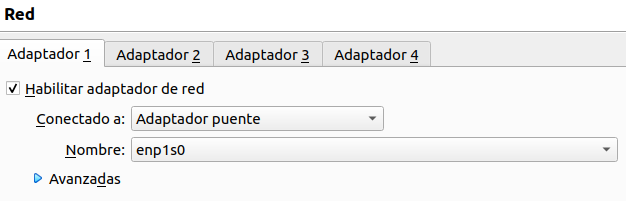
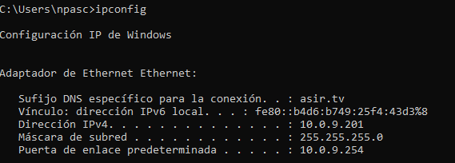
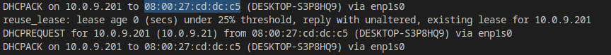
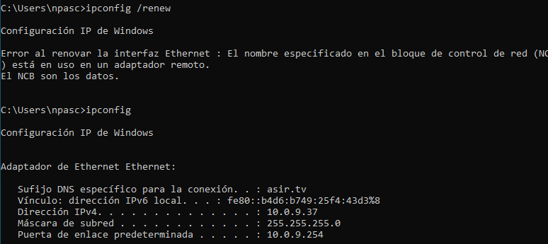

# Proyecto DHCP
#### Nerea Pascual García

# DHCP

## Estructura

Creamos la carpeta llamada **data** y dentro de esta el fichero **dhcpd.conf**.

Creamos el archivo **docker-compose.yml**. 

## docker-compose.yml

El fichero docker-compose.yml contendrá lo siguiente:
~~~
version: '3.4'
services:
  dhcp:
    container_name: asir_dhcp
    network_mode: host
    image: networkboot/dhcpd
    volumes:
      - ./data:/data
~~~

## dhcpd.conf

El fichero dhcpd.conf contendrá los siguiente:
~~~
subnet 10.0.9.0 netmask 255.255.255.0 {

  range 10.0.9.200 10.0.9.202;

  option domain-name-servers 8.8.8.8, 193.146.96.2, 193.146.96.3;
  option domain-name "asir.tv";
  option routers 10.0.9.254;
  option subnet-mask 255.255.255.0;
  option broadcast-address 10.0.9.255;

  default-lease-time 86400;
  max-lease-time 172800;

  group {

     default-lease-time 604800;
     max-lease-time 691200;

     host apache {
         hardware ethernet 00:10:5a:f1:35:87;
         fixed-address 10.0.9.37;
     }

  }
}
~~~

Usamos el comando:

> docker-compose up 

Con esto, se nos descargará la imagen dhcpd y el contenedor se quedará levantado.

## Bridge máquina virtual

### Con rango de IPs

Ponemos la máquina virtual en modo brige.

Nos aseguramos que en las configuraciones de red de la máquina esté en modo DHCP y que el contenedor este levantado.

Abrimos la terminal de la máquina y escribimos lo siguiente:

> ipconfig

El DHCP nos asignará una ip contenida en el rango indicado en el fichero dhcp.conf.

### Con IP Fija

Para hacerlo con IP fija nos movemos al fichero dhcp.conf y borramos la línea de los rangos, es decir:

> range 10.0.9.200 10.0.9.202;

Además, modificaremos el group.

Para ello nos iremos a los logs del contenedor. Buscaremos la ip 10.0.9.201 y copiaremos la MAC correspondiente.

Ahora si, modificaremos el group del fichero dhcp.conf de la siguiente forma:

~~~
group {

     default-lease-time 604800;
     max-lease-time 691200;

     host apache {
         hardware ethernet 08:00:27:cd:dc:c5;
         fixed-address 10.0.9.37;
     }

  }
~~~

Reiniciamos el contenedor.

Volvemos a la máquina virtual y usamos el comando:

> ipconfig /renew

Posteriormente volvemos a usar:

> ipconfig

Nos mostrará la IP indicada en el group (10.0.9.37).

